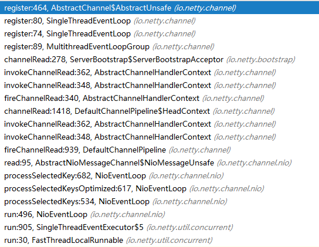

## 前言

前面我们已经介绍了如何将我们的NioServerSocketChannel如何一步步的注册到我们Nio对应的Selector中,本文将进一步的去分析注册之后的serverSocketChannel如何接受和处理客户的连接请求的

首先我们要回到我们的NioEventLoop中，因为他其实就相当于一个线程那么他里面包装了Channel必然也会包装Selecor，于是我们的请求也会在这里被等待连接。到底是怎么样的呢，我们接下来看


## 接入分析

```java
//
protected void run() {
    for (;;) {

        cancelledKeys = 0;
        needsToSelectAgain = false;
        //这里的ioRatio貌似只执行的时间
        final int ioRatio = this.ioRatio;
        if (ioRatio == 100) {
            try {
                processSelectedKeys();
            } finally {
                // Ensure we always run tasks.
                runAllTasks();
            }
        } else {
            final long ioStartTime = System.nanoTime();
            try {
                processSelectedKeys();
            } finally {
                // Ensure we always run tasks.
                final long ioTime = System.nanoTime() - ioStartTime;
                runAllTasks(ioTime * (100 - ioRatio) / ioRatio);
            }
        }
    }
}
```

省略非重要的代码，我们从这个死循环的监听中我们也大概能发现一些奥秘，其实就是如果我们只关心selectorKeys事件的话，那么这两个处理就没有区别，如果我们仔细分析的话就会发现这个ioRatio对应的这个任务等待的事件，


我们首先分析一下processSelectedKeys是如何在NIO的基础上等待任务并进行处理的

```java
private void processSelectedKeys() {
    if (selectedKeys != null) {
        processSelectedKeysOptimized();
    } else {
        processSelectedKeysPlain(selector.selectedKeys());
    }
}
```

分两种策略进行，如果我们有设置`SelectedSelectionKeySet`，那么我们就会直接处理 ，而下面的方式则是和我们上文中的比较类似，会先将任务提交到队列等待执行。

默认情况下我们是有设置selectedKeys为SelectedSelectionKeySet。所以暂时我们先分析直接处理的逻辑

```java
private void processSelectedKeysOptimized() {
    for (int i = 0; i < selectedKeys.size; ++i) {
        final SelectionKey k = selectedKeys.keys[i];   
        selectedKeys.keys[i] = null;
        //NioServerSocketChannel
        final Object a = k.attachment();

        if (a instanceof AbstractNioChannel) {//如果是nioChannel则之间调用
            processSelectedKey(k, (AbstractNioChannel) a);
        } else {
            //否则认为是任务列表
            NioTask<SelectableChannel> task = (NioTask<SelectableChannel>) a;
            processSelectedKey(k, task);
        }

    }
}
```

到这里我们渐渐通过Nio的attachment又拿到我们的NioServerSocketChannel，那么我们是否可以猜测第二种方式或者说上面任务的这种方式是客户端处理的模式的呢？可以思考一下。。。

然后我们继续看对应NioServerSocketChannel的后续处理逻辑

```java
private void processSelectedKey(SelectionKey k, AbstractNioChannel ch) {
        final AbstractNioChannel.NioUnsafe unsafe = ch.unsafe();
        if (!k.isValid()) {//判断是否可用
            final EventLoop eventLoop;
            try {
                eventLoop = ch.eventLoop();//获取channel的evenloop
            } catch (Throwable ignored) {
                return;
            }
            if (eventLoop != this || eventLoop == null) {//线程必须一致
                return;
            }
            unsafe.close(unsafe.voidPromise());
            return;
        }

        try {
            int readyOps = k.readyOps();//获取感兴趣的事件
            if ((readyOps & SelectionKey.OP_CONNECT) != 0) {//则表示连接事件
                int ops = k.interestOps();
                ops &= ~SelectionKey.OP_CONNECT;
                k.interestOps(ops);

                unsafe.finishConnect();//连接完成
            }
            if ((readyOps & SelectionKey.OP_WRITE) != 0) {//判断是否为写事件
                ch.unsafe().forceFlush();
            }
            if ((readyOps & (SelectionKey.OP_READ | SelectionKey.OP_ACCEPT)) != 0 || readyOps == 0) {//接受事件
                unsafe.read();
            }
        } catch (CancelledKeyException ignored) {
            unsafe.close(unsafe.voidPromise());
        }
    }
```

上文非常简单，就是根据不同的事件进行不同的处理，因为多端的代码是复用的，所以设计之初就必须考虑各种情况，因为对于一个常用的服务端来说，或者按照NIO的设计来说，对于服务端而言，我们常用的两阶段设计就是，首先注册一个监听OP_ACCEPT事件的处理逻辑，然后注册一个真正进行OP_READ事件的处理

。而OP_CONNECT事件应该是发生在当我们的OP_ACCEPT正常执行完毕后，客户端和服务端成功建立起连接的时候而OP_WRITE事件表示已经读完数据要回写数据的时候进行的操作。

然后unsafe的read事件将OP_ACCEP和OP_READ的操作都交给unsafe来进行，unfafe指向的就是我们之前所说的NioMessageUnsafe,具体事件的流向如下，



其实从图的netty的事件处理扭转机制可以看出来，netty非常大部分的操作都是交给了pipeline来触发响应阶段的fireXXXX事件来进行处理。

具体的pipeline对应inbound和outbound的流转逻辑暂时我们不在这里仔细描述，这是netty非常重要的一环我们后续详细描述，这里我们主要看一下图的最上面的channelRead方法，其实对应的就是我们注册到pipeline的`ServerBootstrapAcceptor`对象逻辑，

```java
public void channelRead(ChannelHandlerContext ctx, Object msg) {
    final Channel child = (Channel) msg;

    //给msg的channel的pipline注册ChannelHandler ===> 等同于我们在serverBoootStrap中定义的ChannelInitializer
    child.pipeline().addLast(childHandler);
    //子channel设置
    setChannelOptions(child, childOptions, logger);
	//属性设置
    for (Entry<AttributeKey<?>, Object> e: childAttrs) {
        child.attr((AttributeKey<Object>) e.getKey()).set(e.getValue());
    }

    try {
        //给child对应的EventLoopGroup进行注册，并添加完成监听器
        childGroup.register(child).addListener(new ChannelFutureListener() {
            @Override
            public void operationComplete(ChannelFuture future) throws Exception {
                if (!future.isSuccess()) {
                    forceClose(child, future.cause());
                }
            }
        });
    } catch (Throwable t) {
        forceClose(child, t);
    }
}
```

从上文中可以看到，我们在ServerBootstrapAcceptor中的处理极其像我们netty启动时候给group的注册过程，只不过将group的对象换成了childGroup来操作。明白了netty启动时候的注册逻辑，那么这里也非常容易的进行理解，注册了一个如果处理不成功则进行关闭的监听器。

所以我们还是要往childGroup的注册方法里去看，那么其实整体上的操作都差不多，逻辑还是会回到我们的`AbstractUnsafe#register0`方法来进行后续的处理，这里需要留意一下里面的`invokeHandlerAddedIfNeeded`方法。

```java
final void invokeHandlerAddedIfNeeded() {
    assert channel.eventLoop().inEventLoop();
    if (firstRegistration) {
        firstRegistration = false;
        callHandlerAddedForAllHandlers();
    }
}
```

第一次进来的时候firstRegistration默认为true，那么就会调用`callHandlerAddedForAllHandlers`方法来处理。

```java
private void callHandlerAddedForAllHandlers() {
        final PendingHandlerCallback pendingHandlerCallbackHead;
        synchronized (this) {
            registered = true;
            pendingHandlerCallbackHead = this.pendingHandlerCallbackHead;
            this.pendingHandlerCallbackHead = null;
        }
        PendingHandlerCallback task = pendingHandlerCallbackHead;
        while (task != null) {
            task.execute();
            task = task.next;
        }
    }
```

说白了就是首次运行的时候执行PendingHandlerCallback任务来添加handler，所以这个PendingHandlerCallback是什么时候被添加的呢？

这里我们要回顾一下之前的`ServerBootstrapAcceptor#channelRead`方法中有一句`child.pipeline().addLast(childHandler)`是不是有点承接起来的感觉，其实就是会将childHander进行包装

```java
//io.netty.channel.DefaultChannelPipeline#callHandlerCallbackLater
private void callHandlerCallbackLater(AbstractChannelHandlerContext ctx, boolean added) {
    assert !registered;

    PendingHandlerCallback task = added ? new PendingHandlerAddedTask(ctx) : new PendingHandlerRemovedTask(ctx);
    PendingHandlerCallback pending = pendingHandlerCallbackHead;
    if (pending == null) {
        pendingHandlerCallbackHead = task;
    } else {
        // Find the tail of the linked-list.
        while (pending.next != null) {
            pending = pending.next;
        }
        pending.next = task;
    }
}
```

然后我们继续看PendingHandlerCallback执行逻辑，其实也很简单回调context对应的callHandlerAdded方法，然后又在里面回调handler.handerAdded方法，在这里面就会调用当前handler的initChannel方法

非常值得一提的就是这个handler对应的就是我们在启动时候为serverBootStrap注册的childHandler，因为当前我们已经是在操作childGroup了，是不是恍然大悟。突然就到了我们自定义initializer的执行地方，具体看看这个操作是怎么进行的。

```java
private boolean initChannel(ChannelHandlerContext ctx) throws Exception {
    if (initMap.add(ctx)) { // Guard against re-entrance.
        try {
            initChannel((C) ctx.channel());
        } catch (Throwable cause) {
            //
            exceptionCaught(ctx, cause);
        } finally {
            ChannelPipeline pipeline = ctx.pipeline();
            if (pipeline.context(this) != null) {
                pipeline.remove(this);
            }
        }
        return true;
    }
    return false;
}
```

从上文中我们可以看到，最终会通过模板方法回调我们重写的注册逻辑，在执行完成之后就会将当前的这个ChannelInitializer进行移除，也就是他的目的就是为了桥接我们真正的channelHander，因为他本身也是继承了`ChannelInboundHandlerAdapter`。

那么我们是否可以思考一下，对于一个新接入的请求为什么会执行到我们的channelInitializer中，而对于已连接的请求就不会调用channelInitializer。

那么我们就得重新思考一下这个pipeline，因为我们可以看到无论我们是OP_ACCEPT事件还是OP_READ事件，其实来说都是使用的同一套代码，从入口来看那么为什么有两种不同的执行逻辑，下图展示了另外一种进行OP_READ事件时候的处理


从BUG出可以看到这里并没有我们channelInitializer，具体原因有如下几点

1.OP_ACCEPT对应的是NioMessageUnsafe，而OP_READ事件使用的是NioByteUnsafe。那么其实read方法不是同一个read方法

2.由于不是同一个read方法肯定也不是同一个pipeline，在OP_ACCETP事件会经历两个pipeline


## 思考题

为什么要给我们bossEventLoopGroup设置多个线程，因为从注册的逻辑来看，最终我们接入的线程始终都是由我们注册NIO的时候channel所对应的那个eventLoop来处理的？